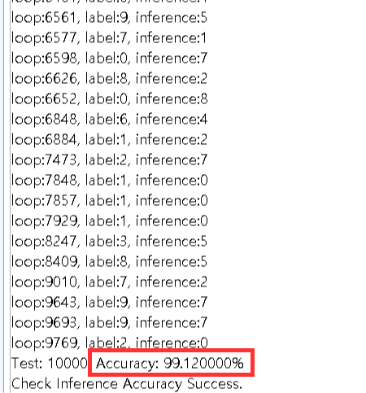

# FPGA-based Efficient LeNet-5 Accelerator


This project addresses an FPGA-based LeNet-5 accelerator designed using `Verilog-2001`. The repository contains the full source code for the LeNet-5 IP, which is assumed to operate on an FPGA, and the interconnect necessary for functioning as a hardware accelerator. It also includes software code for control and operational verification. The goal of this project is to establish an interconnect and system that effectively utilize the hardware accelerator and to lay the groundwork for future hardware designs of modern DNN models.

## Overview
The LeNet-5 model introduced in this project is designed to incorporate well-known optimization techniques for efficiently implementing CNN models in hardware. The internal CNN operations are specifically designed for Tiled Convolution, and the Output Stationary (OS) dataflow method is employed to minimize the movement of partial sum data in convolution operations. The designed LeNet-5 IP is controlled through a Master/Slave structure using AXI-4 and is connected to a DMA module for direct access to DDR memory. In this project, the TE0729 FPGA board used for hardware operation verification controls the ALU area (PL), which includes the LeNet-5 IP, from the internal ZYNQ processor (PS) via the AXI-4 Standard.

## Model description


Input Images : MNIST Test Dataset

This Work | Input | Output | Kernel | Stride | Activation | Note
--------|-------|--------|--------|-----------------|---------|-----------|
Zero Padding | 1x28x28 | 1x32x32  
Conv1   | 1x32x32 | 6x28x28 | 1x6x5x5 | 1   | ReLU  
Pool1   | 6x28x28 | 6x14x14 | | 2 | | max pooling 
Conv2   | 6x14x14 | 16x10x10 | 6x16x5x5 | 1 | ReLU  
Pool2   | 16x10x10 | 16x5x5 | | 2 | | max pooling
Flatten | 16x5x5 | 400x1 | 
FC1     | 400x1 | 120x1 | 400x120  
FC2     | 120x1 | 84x1 | 120x84    
FC3     | 84x1 | 10x1 | 84x10  

## Applied HW Optimization Techniques
### Layer-wise Weight Parameter Quantization

| Quantization Method            |       |
|------------|-----------|
| Feature map quantization data type | 8-bit integer (-128 ~ 127)  | 
| Weight quantization data type | 8-bit integer (-128 ~ 127) | 
| Bias quantization data type | 16-bit integer (-32,768 ~ 32,767)  | 
| Uniformity  | Uniform quantization   | 
| Symmetry  | Symmetric quantization   | 
| Quantization training method  | QAT (Quantization-Aware Training)  | 

The 32-bit fixed-point weight parameters (weight, bias) trained on PyTorch are quantized as shown in the table above and then transplanted to the FPGA for use. For an area-efficient design, the weights are symmetrically quantized to 8-bit integers, and the bias is set to a higher precision because it has a significant impact on inference performance relative to the total number of parameters.

|  Quantization Scale(Inverse)    | Conv1   | Conv2   |  FC1    | FC2     | FC3     |
|-------------------|---------|---------|---------|---------|---------|
| $S^{-1}_{\text{in}}$ (Input feature map ) | 32    | 16    | 4     | 2   | 2   | 
| $S^{-1}_{\text{w}}$ (Weight) | 256   | 128   | 128   | 256 | 256 | 
| $S^{-1}_{\text{b}}$ (Bias) | 8192  | 2048  | 512   | 512 | 512 | 
| $S^{-1}_{\text{out}}$ (Output feature map) | 16    | 4     | 2     | 2   | 2   | 
| $M^{-1}$               | 512 | 512 | 256 |  256  | 256 |

To achieve higher inference performance, the scale factors were tuned individually for each layer. Each parameter's scale value was chosen as a power of 2, enabling the substitution of multiplication with bit shifts in the convolution operations during the scale synchronization process. The scale adjustment factor $M$ required for synchronizing scales across layers is given by $M = \frac{S_{\text{in}} \times S_{\text{w}}}{S_{\text{out}}}$.

### Tiled Convolution 

To facilitate smaller unit operations and conserve hardware memory for the four dimensions ($Wout, Hout, C, N$) used in convolution operations, the concept of Tiled Convolution was introduced. In this project, for any dimension $A$, the tiled dimension is defined as $A = A_B(\text{Tile Num}) \times A_T(\text{Inner Tile Dimension})$.

| Convolution  | Used Tiled Demention | Output(Accumulate) | 
|------------|-------|---------|
| Conv Layer Core | $F_{in}[C_T \times W_{in}], W[N_T \times C_T \times Kw], B[N_T]$  | $F_{out}[N_T \times W_{in T} ]$  | 
| FC Layer Core   | $ F_{in}[C_T], W[N_T \times C_T], B[N_T]$ | $F_{out}[N_T]$ | 

In `cnn_conv_core.v` and `cnn_fc_core.v`, the Tiled Convolution operations as described in the table above are performed. Operations related to the $Kh$ and $N_T$ dimensions are handled in the higher-level modules `cnn_conv_layer.v` and `cnn_fc_layer.v`, respectively.

|  Tiled Demention  | Conv1   | Conv2   |  FC1    | FC2     | FC3     |
|-------------------|---------|---------|---------|---------|---------|
| $W_{out} = W_{out B} \times W_{out T}$ | 28 = 4 * 7 | 10 = 2 * 5 | -    | -      | -     |
| $H_{out} = H_{out B} \times H_{out T}$ | 28 = 4 * 7 | 10 = 2 * 5 | -    | -      | -     |
| $C = C_B \times C_T$ | 1 = 1 * 1 | 6 = 2 * 3 | 400 = 80 * 5 | 120 = 24 * 5 | 84 = 14 * 6 |
| $N = N_B \times N_T$ | 6 = 2 * 3 | 16 = 4 * 4 | 120 = 8 * 15 | 84 = 4 * 21 | 10 = 2 * 5 |

The table shows the tiled dimensions set experimentally for optimal performance, area, and data reuse.

### Dataflow Optimization

#### 1. On-chip Memory(BRAM) Dataflow Optimization
In this project, the convolution operations computed in tile units within `cnn_conv_core.v` and `cnn_fc_core.v` use input feature map, weight, and bias data stored in BRAM.

|              | Code | Processing Element(PE)   |  Convolution Hierarchy   | 
|-------------------|---------|---------|---------|
| Conv Layer Core | `cnn_conv_core.v` | $Kw \times W_{out T} \times C_T \times N_T$  | $H_{out T} \rightarrow Kh \rightarrow PE$ | 
| FC Layer Core  | `cnn_fc_core.v` | $N_T$ | $C_T \rightarrow PE$    | 

#### 2. Off-chip Memory(DRAM) Dataflow Optimization
The LeNet-5 model is an early CNN model with a very small number of total weights. Therefore, in this project, the trained weight parameter data is not read from DRAM but is entirely stored and used in BRAM. However, to accommodate future applications of this design to more modern DNN models, provisions have been made for Dataflow Optimization between DRAM and the ALU. Among various dataflow methods, the Output Stationary (OS) method was adopted to minimize the process of reading and writing partial sums. In this project, designed with this method, the process of reading and writing partial sums is not included in BRAM as well as DRAM; the computed partial sums are stored and used solely within Flip-Flops.


## Verification

### SW Verification using Xilinx VIP
 

`tb_dma_LeNet5.sv` is a testbench based on Xilinx Verification-IP (VIP) designed to verify the operation of the LeNet-5 IP and AXI-4 interconnect. In the simulation, virtual Master and Slave components are created for AXI-4 communication to observe the performance of the LeNet-5 IP module. The results are as follows.

####  Simulation Result
|   | Test Images  | Max latency | Max delay     |  Accuracy   | Simulation Runtime |
|------------|---------|-------|---------|---------|-----------------|
| LeNet-5  | 100(No.1~100) | 17,964 cycle | 71,914 cycle  | 100 % | 2.5 Hours

### HW Verification using Xilinx ILA
 

To verify the actual hardware operation, the Xilinx ILA(Integrated Logic Analyzer) module was connected to the AXI-4 channels of the LeNet-5 IP to validate the behavior of the Master and Slave. The ILA run trigger was set to the Ready/Valid handshake of the AXI-4 AR, AW channel.

## Performance

###  Resource Utilization
 

|  Resource | LUT   | FF   |  BRAM    | DSP     |
|------------|-------|---------|---------|---------|
| LeNet-5 IP         | 6,453 | 9,455  | 37.5 | 122   | 
| LeNet-5 with AXI-4 Interconnect | 7,770 | 11,338 | 37.5 | 122   | 

### FPGA Board Test
|| 
|------------|-----------|


|         | FPGA | Clock Freq.   | HW Runtime | Test Images  | Accuracy   | FPS |    
|---------|-----|-------|---------|---------|---------|--------|
| LeNet-5 | TE0729(ZC7Z020)  | 100 MHz  | 1.797 sec |  10,000 | 99.12 %  | 5,564.8 |    | 


 
## How To Use
### Run SW LeNet-5
* Generate Quantized Parameter :
```
    cd HW/sim
    ./train_and_save.py 1 
``` 

* Test Quantized LeNet-5 Model :
```
    ./load_and_test.py
```

### Run XSIM Simulator
* Run `LeNet5_core_ip.cpp` to generate Golden Reference :
```
    ./run.py -refc
```

* Run XSIM Simulation :
```
    ./run.py -nwf   ## Simulation without waveform
    ./run.py -tbwf  ## Simulation with Tectbench signal waveform
    ./run.py -twf   ## Simulation with Top Module signal waveform
    ./run.py -cwf   ## Simulation with LeNet-5 Core IP signal waveform
    ./run.py -swf
    <Module Path>   ## Simulation with Submodule signal waveform
```

* Comparison XSIM results with Golden reference :
```
    ./run.py -diff
```

### Input Mode (in Xilinx Vitis Serial Terminal)
```
    1 ## READ Quantized LeNet-5 Parameter 
    2 ## HW RUN 
    3 ## CHECK SW vs HW result
    4 ## Check Memory State
```

## Tools
```
    ZC7Z020
    Xilinx Vivado 2022.2
    Xilinx Vitis 2022.2
    Xilinx Verification-IP v1.1
    Python 3.8.10 
    CUDA 12.8
```

## Contributors
    HoJun Jeong (Dankook University, Undergraduate, South Korea), findgps@naver.com

